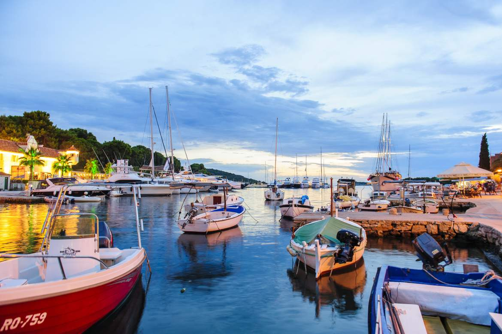

<figure class="figure">
    
    <figcaption class="figure__caption">Šolta</figcaption>
</figure>

## Best authentic coastal destination in Croatia

Authentic Croatia on the coast – the choices are seemingly endless, but where to find the best authentic coastal destination?

The answer, for 2017 at least, is a small boat ride from Split. While the islands of Brac, Hvar and Vis may attract most of the tourism headlines when it comes to central Dalmatian islands, there is one hidden gem which lies outside of the spotlight, but which is growing in reputation as one of Croatia’s most relaxing and enticing experiences.

Just an hour by ferry from Split, the island of Solta offers an escape from the daily pressures of life, its spectacular nature and unhurried way of life, combined with its authentic gourmet offer, which includes some of the best olives and honey in the region. A timeless Dalmatian experience, just a short ride from Split.

Solta’s magic was recognised recently ar the annual Days of Croatian Tourism Awards in Split, where Maslinica on Solta was crowned Best Authentic Coastal Tourism Destination in Croatia.

The Solta Tourist Board Director Zorana Kastelanac accepted the award from the Director of the Croatian Tourist Board, Kristijan Stanicic and the State Secretary of the Ministry of Tourism, Tonci Glavina.

Zorana said: “Our efforts paid off and we can be very happy and proud, Maslinica really deserved to take the victory in this category.”

# [Source](http://www.dalmatia.hr/blog/maslinica-solta-best-authentic-coastal-destination-croatia/)