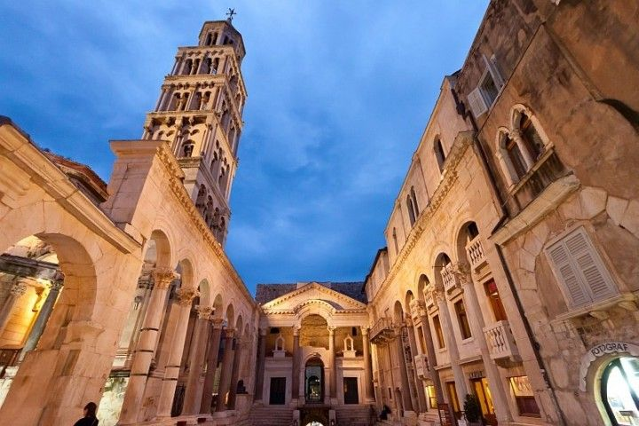

<!-- markdownlint-disable MD033 -->

<figure class="figure">
    
    <figcaption class="figure__caption">Split</figcaption>
</figure>

## Things to do in Dalmatia UNESCO sites

Four out of seven UNESCO Heritage sites in Croatia are located in Dalmatia. A medieval town of Trogir with lovely Baroque, Renessance, and Gothic palaces, street layout typical for ancient Greek towns, Romanesque church of St. Lawrence, boardwalk, and the Kamerlengo Castle, is not to be missed.

Split old town, set within Diocletian Palace from the turn of 4th century, is a living museum, and a town full of history and great vibe.

Built for over 100 years, from 1431 to 1536, St. James Cathedral in Sibenik is a perfect example of transition from Gothic to Renaissance architecture. The construction was overseen by three different architects over the time, it's built entirely of stone, and it features very interesting sculptured faces.

Stari Grad Plains are located on the island of Hvar. Set up by ancient Greeks, this farming landscape remained almost intact since 4th century. It still features geometrical land divisions, bordered by stone walls, trims, and shelters. People still cultivate here olives, grapes, and veggies just like centuries ago.

# [Source](https://www.frankaboutcroatia.com/dalmatia-croatia/#UNESCO-sites)