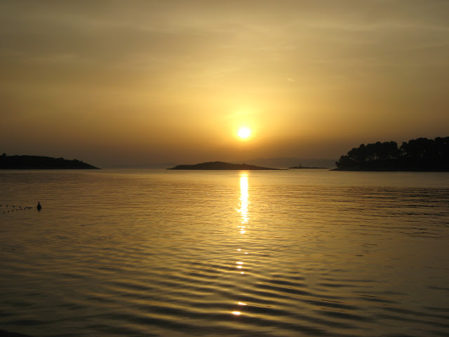

<!-- markdownlint-disable MD033 -->

<figure class="figure">
    
    <figcaption class="figure__caption">Sunset</figcaption>
</figure>

So why visit the Dalmatian Coast of Croatia at all? While there’s plenty to see in cities like Zagreb and Zadar, the long, thin nation is mostly coastline. Much of its history is based in this area too, which starts with Roman settlements. It’s also, arguably, the most beautiful area of the country. Crystal blue waters of the Adriatic and barrier islands make it a popular spot with vacationers from Britain and Australia, as well as the rest of Europe. Americans don’t seem to have caught on quite yet, as I only met one other while I was there.

## What to Expect?

<figure class="figure">
    
    <figcaption class="figure__caption">Croatian food</figcaption>
</figure>

While the cost of traveling in Croatia may have gone up in the last six years, it’s still a great value destination. Distances aren’t very far so you can take public transportation very cheaply and easily. Food is delicious, especially on the coast where seafood is plentiful. The cuisine is similar to what you’ll find in Italy and the Balkans, including whole fish, risottos, and sausage platters. Konobas are the Croatian versions of trattorias, simple family-run eateries that have the best meals and prices.

Don’t worry about drinking the water here, as they have Roman aqueducts. It is, in my opinion, the best drinking water in the world. If you want something stronger, you can do it very cheaply. Beer from brands like Ozujsko and Karlovacko are very drinkable, especially if you’re cooling off after spending a day at the beach. Liquor is more expensive, but rakija is the national firewater.

# [Source](https://www.carolineinthecityblog.com/2016/03/17/guide-croatias-dalmatian-coast/)
